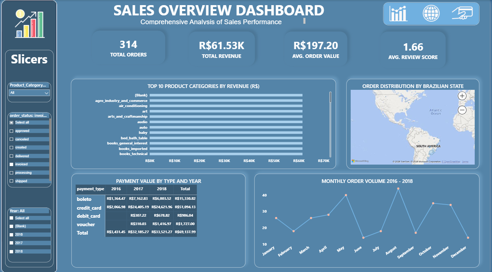
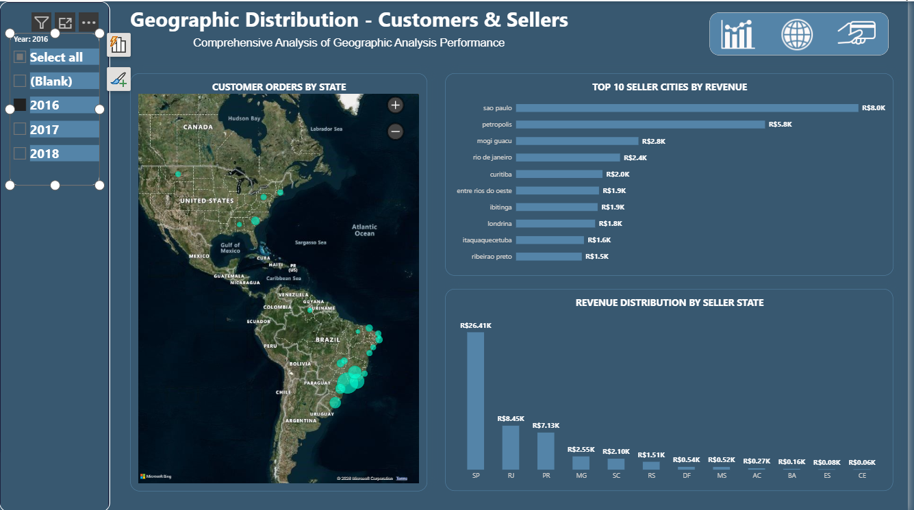
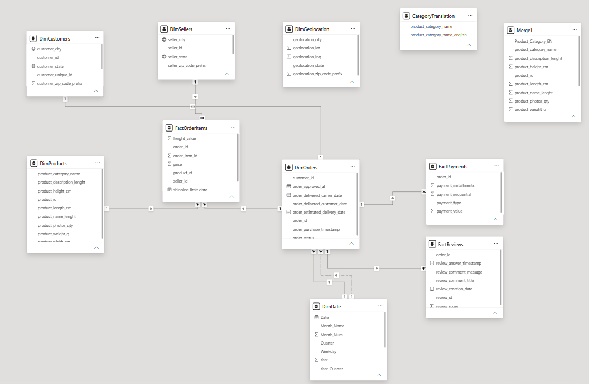

# Power BI PR3 – Brazilian E-Commerce Analytics Dashboard

A comprehensive Power BI project based on the **Brazilian E-Commerce Public Dataset by Olist**.

This project focuses on data modelling, star schema design, relationships, date intelligence, geographic analysis, payment analysis, customer reviews, and interactive Power BI dashboards.

---

## 📌 Project Overview

This project was created as part of **Power BI Practical Report 3 (PR3)**.

The main objective is to build a structured Power BI data model using the Brazilian E-Commerce dataset and create interactive dashboards for analyzing:

- Sales performance
- Customer orders
- Seller performance
- Geographic distribution
- Payment methods
- Customer review scores
- Monthly order trends
- Product category revenue

The project uses a **multi-fact data model** with `FactOrderItems`, `FactPayments`, and `FactReviews` sharing `DimOrders`.

---

## 📊 Dataset

### Brazilian E-Commerce Public Dataset by Olist

**Source:** Olist / Kaggle

Dataset contains multiple CSV files representing orders, customers, products, sellers, payments, reviews, and geographic information.

🔗 **Kaggle Dataset:**

https://www.kaggle.com/datasets/olistbr/brazilian-ecommerce

---

## 🗂️ Dataset Tables

The project uses the following 9 CSV files:

| CSV File | Model Table | Type |
|---|---|---|
| `olist_order_items_dataset.csv` | FactOrderItems | Fact |
| `olist_orders_dataset.csv` | DimOrders | Dimension |
| `olist_customers_dataset.csv` | DimCustomers | Dimension |
| `olist_products_dataset.csv` | DimProducts | Dimension |
| `olist_sellers_dataset.csv` | DimSellers | Dimension |
| `olist_order_payments_dataset.csv` | FactPayments | Fact |
| `olist_order_reviews_dataset.csv` | FactReviews | Fact |
| `olist_geolocation_dataset.csv` | DimGeolocation | Lookup |
| `product_category_name_translation.csv` | CategoryTranslation | Lookup |

The product category translation data was merged into `DimProducts` as `Product_Category_EN`.

---

# ⭐ Data Model

The project uses a **Star Schema with a Snowflake extension and multiple fact tables**.

### Main Fact Table

`FactOrderItems`

It contains measurable transaction-level information such as:

- `price`
- `freight_value`
- `order_id`
- `product_id`
- `seller_id`

### Dimension Tables

- `DimOrders`
- `DimCustomers`
- `DimProducts`
- `DimSellers`
- `DimDate`

### Additional Fact Tables

- `FactPayments`
- `FactReviews`

Both payment and review facts connect through `DimOrders`.

---

## 🔗 Relationships

All 7 active relationships use appropriate cardinality and single-direction filtering.

| # | From | Column | To | Column | Cardinality | Status |
|---|---|---|---|---|---|---|
| 1 | FactOrderItems | `order_id` | DimOrders | `order_id` | Many-to-One (*:1) | Active |
| 2 | FactOrderItems | `product_id` | DimProducts | `product_id` | Many-to-One (*:1) | Active |
| 3 | FactOrderItems | `seller_id` | DimSellers | `seller_id` | Many-to-One (*:1) | Active |
| 4 | DimOrders | `customer_id` | DimCustomers | `customer_id` | Many-to-One (*:1) | Active |
| 5 | DimDate | `Date` | DimOrders | `order_purchase_timestamp` | One-to-Many (1:*) | Active |
| 6 | FactPayments | `order_id` | DimOrders | `order_id` | Many-to-One (*:1) | Active |
| 7 | FactReviews | `order_id` | DimOrders | `order_id` | Many-to-One (*:1) | Active |

### Inactive Relationship

An additional inactive date relationship was created:

`DimDate[Date]` → `DimOrders[order_delivered_customer_date]`

This relationship can be activated when required using `USERELATIONSHIP()` in DAX.

---

# 📅 DimDate Calendar Table

A dedicated `DimDate` calendar table was created in Power Query.

It contains:

- `Date`
- `Year`
- `Quarter`
- `Month_Num`
- `Month_Name`
- `Weekday`
- `Year_Quarter`

`DimDate` was marked as a Date Table and `Month_Name` was sorted using `Month_Num`.

This enables proper:

- Year analysis
- Quarter analysis
- Month sorting
- Drill-down
- Time intelligence

---

# 🔽 Hierarchies

Four hierarchies were created for drill-down analysis:

### 1. Date Hierarchy

`Year → Quarter → Month_Name`

### 2. Product Hierarchy

`Product_Category_EN → product_id`

### 3. Seller Location

`seller_state → seller_city`

### 4. Customer Location

`customer_state → customer_city`

---

# 📈 Dashboard Pages

## 1. Sales Overview

The Sales Overview dashboard provides a high-level view of sales performance.

### Main KPIs

- Total Orders
- Total Revenue
- Average Order Value
- Average Review Score

### Visuals

- Top 10 Product Categories by Revenue
- Order Distribution by Brazilian State
- Payment Value by Type and Year
- Monthly Order Volume (2016–2018)

---

## 2. Geographic Analysis

This page focuses on customer and seller geographic performance.

### Visuals

- Customer Orders by State
- Top 10 Seller Cities by Revenue
- Revenue Distribution by Seller State
- Year Slicer

Customer and seller location hierarchies are used for geographic drill-down.

---

## 3. Payments & Reviews

This page analyzes payment behavior and customer satisfaction.

### Visuals

- Average Customer Review Score by Product Category
- Payment Method Distribution
- Yearly Payment Summary by Payment Method
- Year Slicer

Payment analysis uses `FactPayments`, while review analysis uses `FactReviews`.

---

# 🖼️ Dashboard Screenshots

### Sales Overview



### Geographic Analysis



### Payments & Reviews


### Model View – Star Schema



---

# 🛠️ Tools & Technologies

- **Power BI Desktop**
- **Power Query**
- **DAX**
- **Microsoft Bing Maps / Power BI Map Visual**
- **GitHub**
- **GitHub Desktop**
- **Kaggle Dataset**

---

# 🔍 Key Power BI Concepts Demonstrated

This project demonstrates:

- Data Modelling
- Star Schema
- Snowflake Schema Extension
- Multiple Fact Tables
- Fact Constellation / Galaxy Schema
- Primary Keys and Foreign Keys
- One-to-Many Relationships
- Active Relationships
- Inactive Relationships
- Single-Direction Filtering
- Bi-Directional Filter Risk
- Date Table
- Time Intelligence
- Hierarchies
- Drill-down
- Geographic Data Categories
- KPI Cards
- Matrix Visuals
- Donut Charts
- Bar Charts
- Column Charts
- Line Charts
- Map Visuals
- Slicers
- Report-level Filters

---

# 🎯 Key Insights

The dashboard provides an interactive way to explore:

- Revenue contribution by product category
- Order volume across Brazilian states
- Seller performance by city and state
- Payment method distribution
- Payment trends across years
- Customer review performance
- Monthly order volume
- Geographic customer and seller distribution

---

# 📁 Repository Structure

```text
PowerBI_PR3_Olist_Ecommerce_Analytics/
│
├── README.md
├── PR.3.pbix
│
├── olist_customers_dataset.csv
├── olist_geolocation_dataset.csv
├── olist_order_items_dataset.csv
├── olist_order_payments_dataset.csv
├── olist_order_reviews_dataset.csv
├── olist_orders_dataset.csv
├── olist_products_dataset.csv
├── olist_sellers_dataset.csv
├── product_category_name_translation.csv
│
└── screenshots/
    ├── Sales_Overview.png
    ├── Geographic_Analysis.png
    ├── Payments & Reviews.png
    └── Model_View.png
